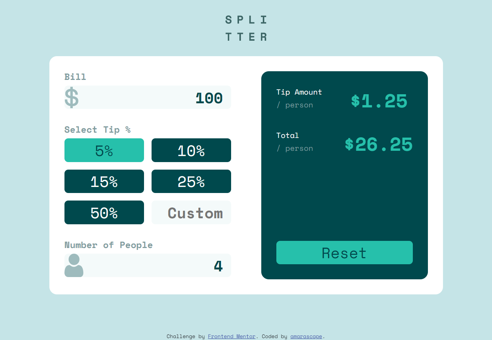
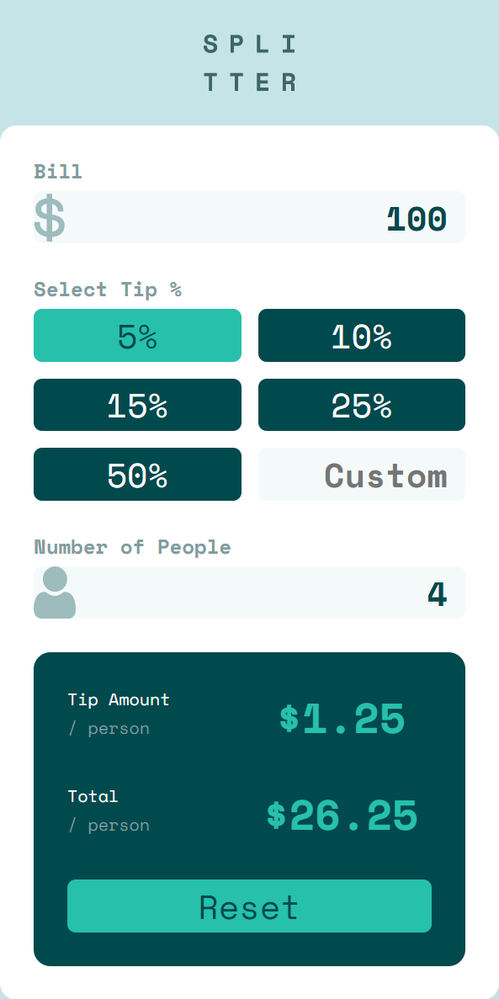

# Frontend Mentor - Tip calculator app solution

This is a solution to the [Tip calculator app challenge on Frontend Mentor](https://www.frontendmentor.io/challenges/tip-calculator-app-ugJNGbJUX). Frontend Mentor challenges help you improve your coding skills by building realistic projects.

## Table of contents

- [Overview](#overview)
  - [The challenge](#the-challenge)
  - [Screenshots](#screenshots)
  - [Links](#links)
- [My process](#my-process)
  - [Built with](#built-with)
  - [What I learned](#what-i-learned)
- [Author](#author)

## Overview

### The challenge

Users should be able to:

- View the optimal layout for the app depending on their device's screen size
- See hover states for all interactive elements on the page
- Calculate the correct tip and total cost of the bill per person

### Screenshots

#### Desktop



#### Mobile



### Links

- Solution URL: [https://amarascape.github.io/tip-calculator-app-vanilla-js/](https://amarascape.github.io/tip-calculator-app-vanilla-js/)

## My process

### Built with

- Semantic HTML5 markup
- CSS custom properties
- Flexbox
- CSS Grid
- Mobile-first workflow
- Vanilla JS

### What I learned

#### How to make a sticky footer

[source](https://stackoverflow.com/questions/8824831/make-div-stay-at-bottom-of-pages-content-all-the-time-even-when-there-are-scrol)

```CSS
#footer {
  position: absolute;
  bottom: 30px;
  width: 100%;
}
```

#### How to use JavaScript to format a number as currency

```JS
// Create our number formatter.
var formatter = new Intl.NumberFormat("en-US", {
  style: "currency",
  currency: "USD",

  // These options are needed to round to whole numbers if that's what you want.
  //minimumFractionDigits: 0, // (this suffices for whole numbers, but will print 2500.10 as $2,500.1)
  //maximumFractionDigits: 0, // (causes 2500.99 to be printed as $2,501)
});
```

#### How to get the element generating an event in JavaScript

```JS
function myFunction(event) {
  let elementGeneratingEvent = event.target;
  //for example, if event was an input,
  //i could now write
  //elementGeneratingEvent.value
  //to get the value of the output
}
```

#### How to set min and max values for a number input

```HTML
<input type="number" oninput="attemptCompute()" min="0.01" max="10000.00" step="0.01" />
```

#### How to dynamically read the input of a text input

```HTML
<input type="number" oninput="readSelected(event)" />
```

## Author

- GitHub - [amarascape](https://github.com/amarascape)
